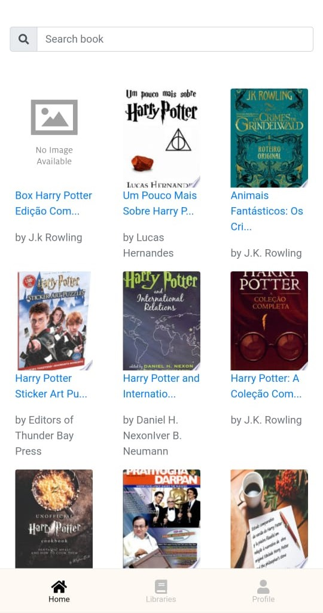

# 🤖 React Google Books

<h1 align="center">
    
    <br/>
 <a href="https://www.php.net/downloads" target="_blank" rel="noopener">Javascript</a> | <a href="https://laravel.com/docs/8.x" target="_blank" rel="noopener">React</a>
</h1>

<p align="center">
  
  
  
<p>

<h3 align="center">
  <a href="#-sobre">Sobre</a>
  <span> · </span>
  <a href="#-tecnologias-utilizadas">Tecnologias utilizadas</a>
  <span> · </span>
  <a href="#-como-usar">Como usar</a>
   <span> · </span>
   <a href="#-imagens-de-demonstracao">Imagens de demonstração</a>
</h3>

## 💭 Sobre

O sistema consiste em uma consulta simples na API de livros do Google.

## 👨‍💻 Tecnologias Utilizadas

- <a href="https://reactjs.org/" target="_blank" rel="noopener">React</a>

## ⁉ Como usar

### 🤔 Pré-requisitos

Para conseguir utilizar a aplicação sem nenhum problema é necessário ter em sua máquina:

- O **<a href="https://nodejs.org/en/" target="_blank" rel="noopener">Node.js</a>** instalado no computador para a execução do projeto
- Ter em sua máquina o **<a href="https://www.npmjs.com/" target="_blank" rel="noopener">NPM</a>** ou **<a href="https://yarnpkg.com/" target="_blank" rel="noopener">Yarn</a>** para o gerenciamento dos pacotes da aplicação
- **<a href="https://getcomposer.org" target="_blank" rel="noopener">Git</a>** para clonar o repositório em seu
  computador.

### 📝 Passo a passo

Para executar a aplicação é fácil, basta seguir os passos abaixo:

1. Clonando o repositório

```sh
  # Clone o repositório
  $ git clone https://github.com/Gabrielpatrola/react-books.git
  # Entre na pasta raiz da aplicação
  $ cd react-books
```

2. Instalando dependências da aplicação

```sh
  # Instale as dependências da aplicação
  $ yarn # ou npm install
```

3. Iniciando o frontend

```sh
  # Comando para iniciar a aplicação
  $ yarn start # ou npm start
```

### 📸 Imagens de demonstração




<sup> Feito com 💙 por <a href="https://github.com/gabrielpatrola" target="_blank" rel="noopener">Gabriel Patrola</a>.</sup>
